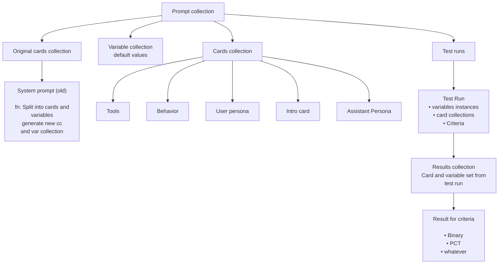

```mermaid
graph TD
PC[Prompt collection]

PC --> OCC[Original cards collection]
PC --> VC[Variable collection<br/>default values]
PC --> CC[Cards collection]
PC --> TR[Test runs]

OCC --> SP["System prompt (old)<br/><br/>fn: Split into cards and<br/>variables<br/>generate new cc<br/>and var collection"]

CC --> T[Tools]
CC --> B[Behavior]
CC --> UP[User persona]
CC --> IC[Intro card]
CC --> AP[Assistant Persona]

TR --> TRun["Test Run<br/>• variables instances<br/>• card collections<br/>• Criteria"]

TRun --> RC["Results collection<br/>Card and variable set from<br/>test run"]

RC --> RFC["Result for criteria<br/><br/>• Binary<br/>• PCT<br/>• whatever"]
```
